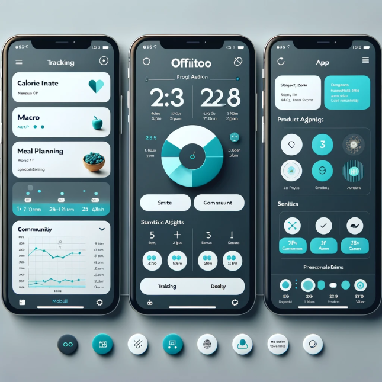

## oFitoo-mobile
oFitoo is an innovative mobile application designed to help you take care of your health , monitor your nutrition   
and achieve goals related to diet and physical activity.   
The application combines the best features of popular solutions such as MyFitnessPal and Fitatu, while offering   
simplicity and the ability to disconnect modules that are unnecessary for us.


### The main features of oFitoo are:

**Calorie Intake Tracker:** Monitor your daily calorie, macronutrient and micronutrient intake to stay on top of your diet.  
**Meal Planning:** Create personalized eating plans tailored to your goals and preferences.  
**Barcode Scanning:** Add foods to your food diary quickly and easily by scanning their barcodes.  
**Statistics and Charts:** Receive charts and statistics to help you monitor your progress and achieve your goals.  
**Social and Motivation:** Allow your partner to edit your meals, making it easier to track your meals and track your performance.  



## Directory Structure
The directory structure of the project is as follows including important files:

```yaml
├── app
│     ├── src
│          ├── main
│          ├── test
│          ├── androidTest
│     
│
```

